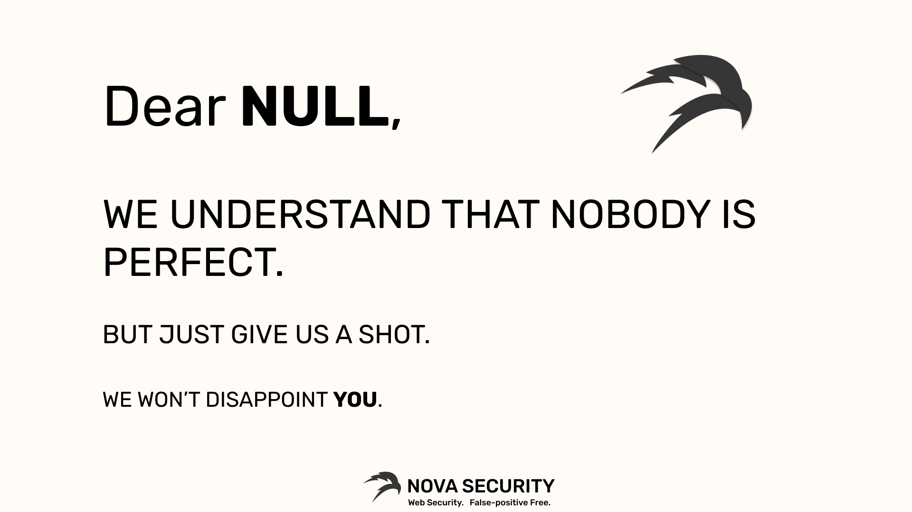

# Community Scripts
A list of open-source community scripts published to help you automate your work. Want the full automated version? Cloud-based? And aimed at helping dev teams to find vulnerabilities early on? Check out (https://novasec.io)[https://novasec.io]

## Tools:
- [Google Tag Manager Subdomain Enumeration](GTM-subdomain-enum)
- [URLFilter](URLFilter)

 

Enjoy!
🥷